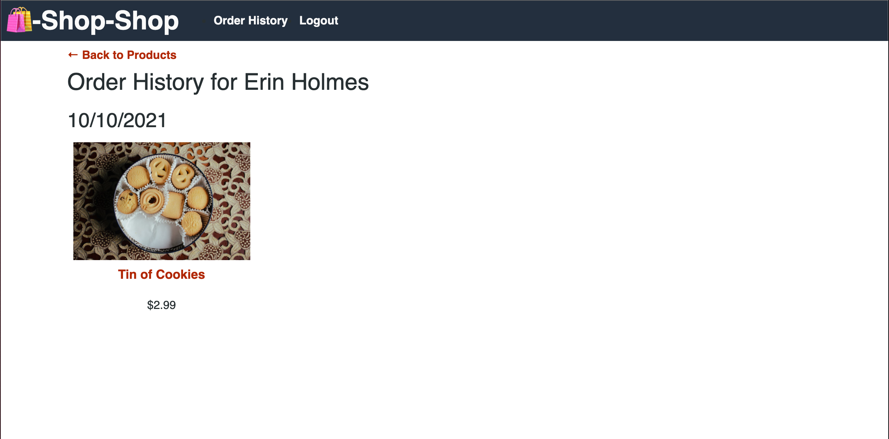

# Redux Store

## Redux State Challenge

## Description
The module for week 22 was focused around using a Global State Object to pass and update application state, as opposed to prop drilling. Using the knowledge and application built in the module we converted the existing global state object from React's Context API, to a Redux Store. This application is a MERN stack, utilizing MongoDB, Express.js, React.js, and Node.js as it's key technologies. As well as Stripe for payment processing. This challenge demonstrates how developers will ultimately need to learn a new technology with only the tool's documentation as a guide. 

Deployed Application: https://shop-shop-redux-eh.herokuapp.com/ 

## Table of Contents
* [Installation](#installation)
* [Usage](#usage)
* [Deployed Application](#deployed-application)
* [Screenshots](#screenshots)
* [Questions](#questions)

## Installation
To install all necessary dependencies run the following command: 

    npm install

## Usage
For local usage, clone the repo on you local manchine and open in an IDE. If you haven't already, make sure you have node.js installed as well as npm (check installation: `node -v` & `npm -v`). In the packages root directory, run `npm i` to install the necessary dependencies. Running `npm i` from the root directory will install dependencies for the client and server directories. Once package installation is complete, run `npm run develop` from the root directory to concurrently start both the client-side React server and server-side Express.js server. If both servers start up correctly, the app should launch in your default browser. 

## Deployed Application
https://shop-shop-redux-eh.herokuapp.com/

## Screenshots

## Questions
If you have any questions or feedback, create a new issue and add the label "question". 
View more of my work: [github.com/emholmes](https://github.com/emholmes).